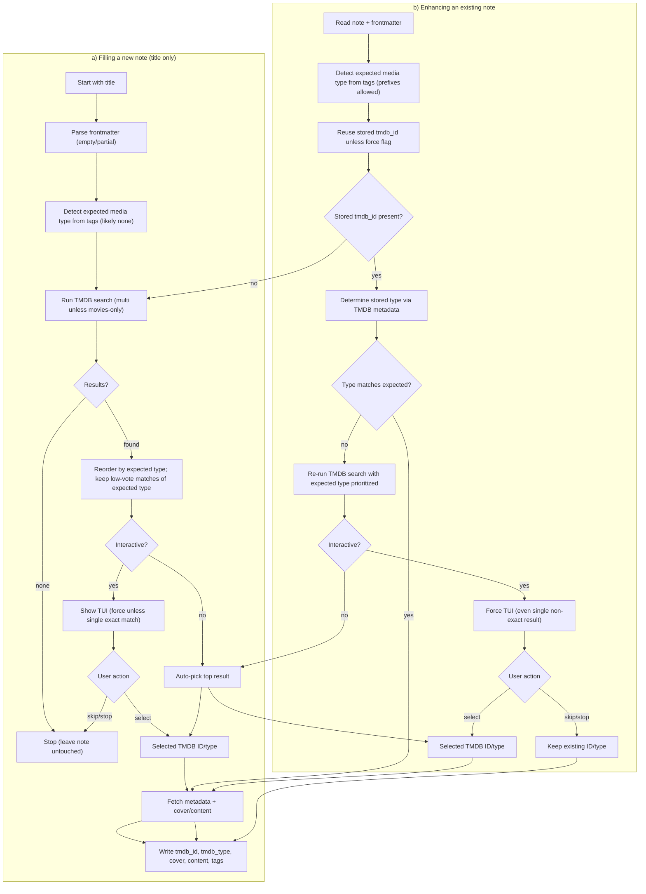

# TMDB Enrichment Flow

```mermaid
flowchart TD
  %% New note ingestion (title only)
  subgraph NewNote["a) Filling a new note (title only)"]
    A["Start with title"] --> B["Parse frontmatter (empty/partial)"]
    B --> C["Detect expected media type from tags (likely none)"]
    C --> D["Run TMDB search (multi unless movies-only)"]
    D --> E{Results?}
    E -->|none| F["Stop (leave note untouched)"]
    E -->|found| G["Reorder by expected type; keep low-vote matches of expected type"]
    G --> H{Interactive?}
    H -->|yes| I["Show TUI (force unless single exact match)"]
    H -->|no| J["Auto-pick top result"]
    I --> K{User action}
    K -->|select| L["Selected TMDB ID/type"]
    K -->|skip/stop| F
    J --> L
    L --> M["Fetch metadata + cover/content"]
    M --> N["Write tmdb_id, tmdb_type, cover, content, tags"]
  end

  %% Enhancing an existing note
  subgraph EnhanceNote["b) Enhancing an existing note"]
    A2["Read note + frontmatter"] --> B2["Detect expected media type from tags (prefixes allowed)"]
    B2 --> C2["Reuse stored tmdb_id unless force flag"]
    C2 --> D2{Stored tmdb_id present?}
    D2 -->|no| D
    D2 -->|yes| E2["Determine stored type via TMDB metadata"]
    E2 --> F2{Type matches expected?}
    F2 -->|yes| M
    F2 -->|no| G2["Re-run TMDB search with expected type prioritized"]
    G2 --> H2{Interactive?}
    H2 -->|yes| I2["Force TUI (even single non-exact result)"]
    H2 -->|no| J
    I2 --> K2{User action}
    K2 -->|select| L2["Selected TMDB ID/type"]
    K2 -->|skip/stop| M2["Keep existing ID/type"]
    J --> L2
    L2 --> M
    M --> N
    M2 --> N
  end
```
